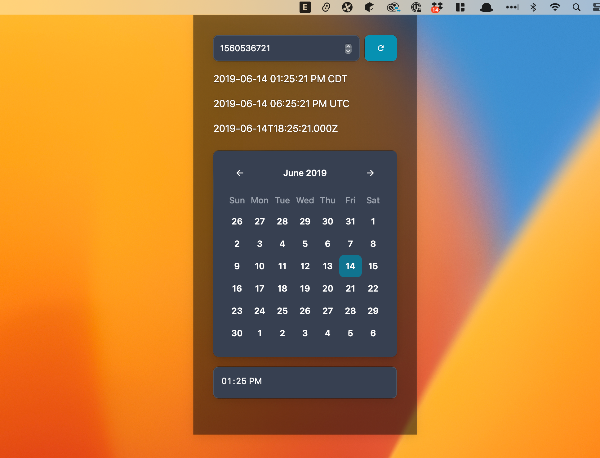
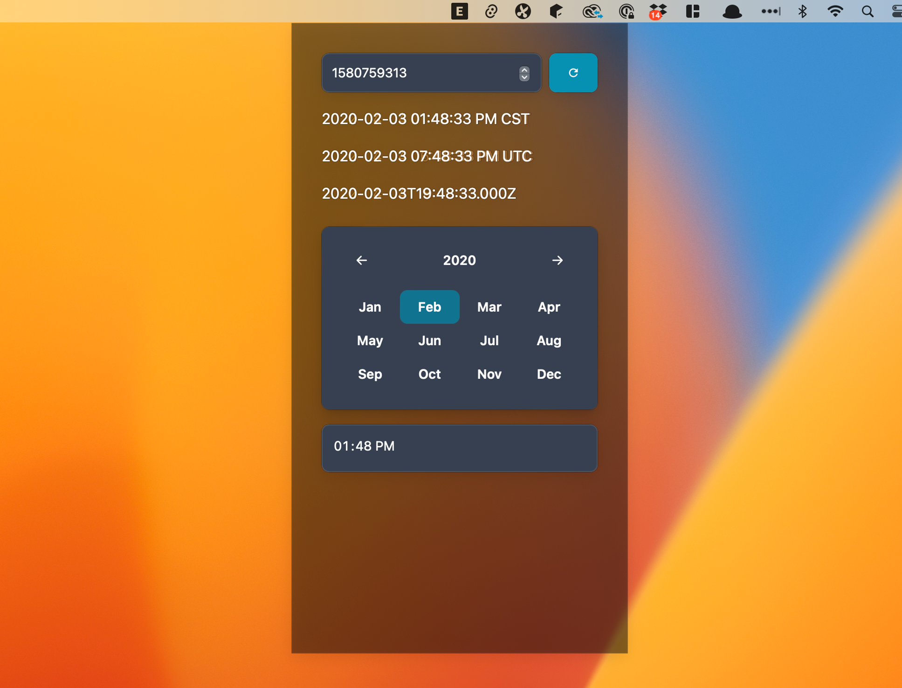
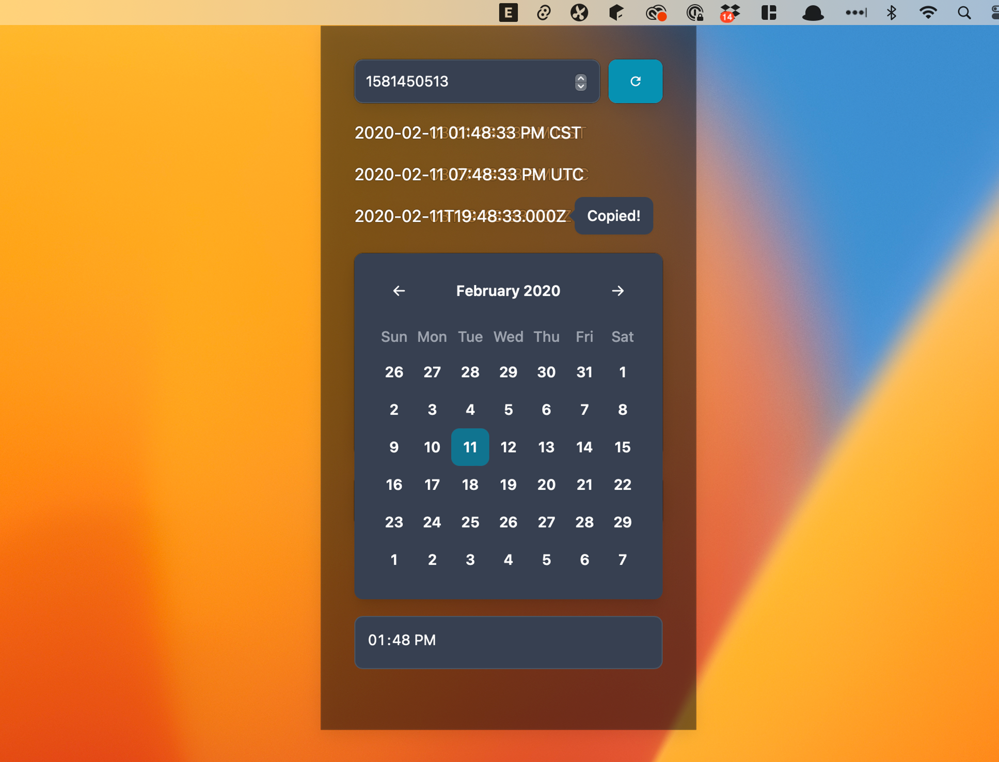

# Epocher
### Overview
This utility is designed for the Mac menu bar, offering an efficient way to convert epoch time into human-readable dates and times. It's perfect for developers, system administrators, or anyone who needs to work with timestamps, providing quick access to date and time conversions directly from the menu bar. With support for displaying times in your local time zone and UTC, and a built-in calendar for easy date selection, it streamlines the process of working with epoch times.

### Features
- Epoch Time Conversion: Convert epoch times into a readable format with ease.
- Local Time and UTC Display: View the converted time in both your local time zone and UTC.
- Clipboard Support: Easily copy the date and time in ISO format to your clipboard.
- Calendar Integration: Select dates through a calendar interface, with the epoch time automatically updated.
- Refresh Functionality: Quickly reset to the current date and time at the click of a button.

### Installation
To install the application:

1. Go to the [GitHub Releases page](https://github.com/keenanlk/epocher-v2/releases/latest) and download the latest version.
2. Unzip the downloaded file and move the application to your Applications folder.
3. Open the application from your Applications folder to place it in your Mac's menu bar.

### Usage
Once the application is running in your Mac's menu bar, click on its icon to open the user interface. Here, you can:

- Input Epoch Time: Type an epoch time value to see it converted into a readable date and time for both your local timezone and UTC.
- Calendar Selection: Use the calendar to pick a date, and adjust the time as needed. The epoch time will update accordingly.
- Copy to Clipboard: Click the ISO date string to copy it to your clipboard.
- Refresh: Use the refresh button to update the displayed time to the current moment.

### Screenshots

### License
This project is licensed under the MIT License. See the LICENSE file for more details.